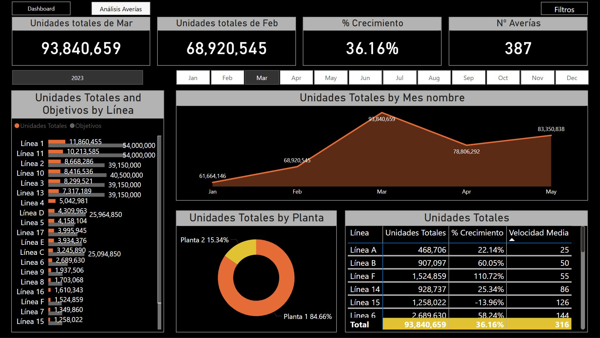
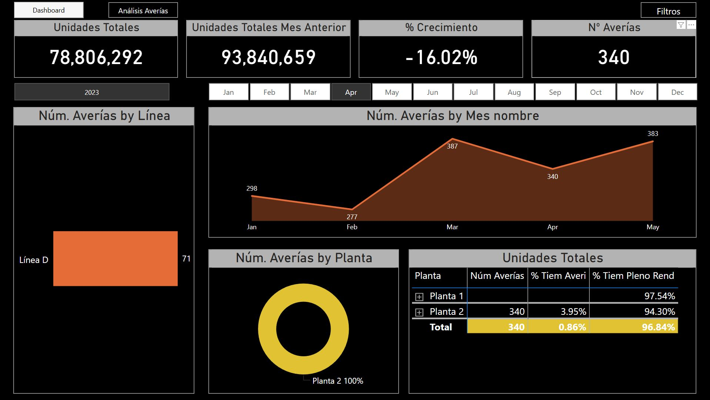
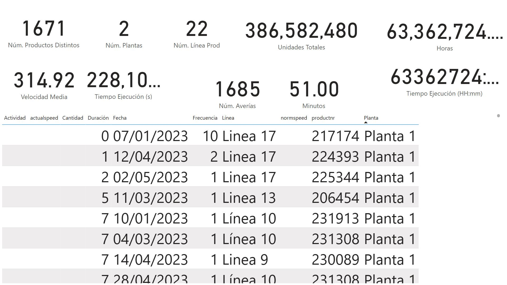
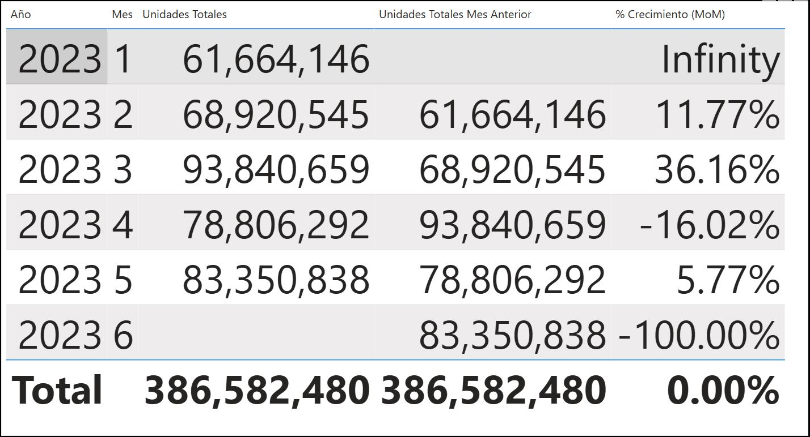
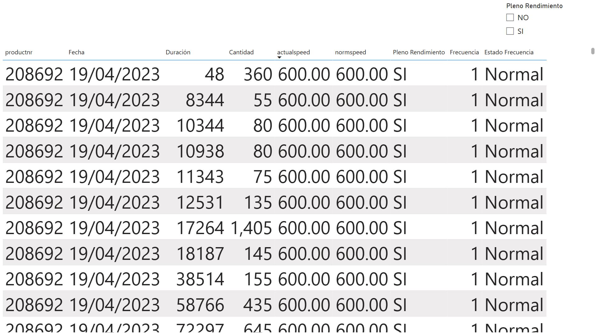
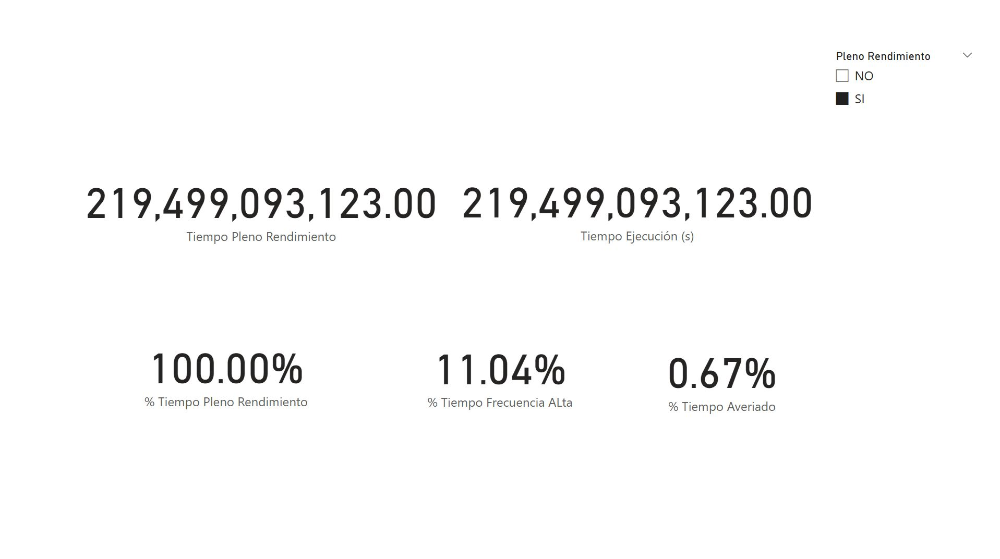

# 📊 Power BI – Data Extraction & Manipulation

<p align="center">
  
  
  
  
  
  
</p>

This project showcases a **Power BI dashboard** designed to demonstrate skills in **data extraction, transformation, visualization, and KPI analysis** within a manufacturing context.

> *💡 The goal of this project is to provide a comprehensive overview of production performance through dynamic and interactive visuals.*


## 🧩 Overview

The dataset simulates production operations across multiple **plants** and **lines**.  
The dashboard delivers key insights into:

- 📦 Total Units Produced by Plant, Line, and Month  
- 📈 Monthly Growth (%) and Performance Trends  
- ⚙️ Average Production Speed  
- 🛠️ Equipment Failures & Downtime Analysis  
- ⏱️ Execution vs. Full Performance Time  
- 🎯 Efficiency and Line Objectives  

## 🧰 Tools & Technologies

- **Power BI Desktop**
- **DAX (Data Analysis Expressions)** for calculated measures and KPIs  
- **Data Modeling** with relationships and hierarchies  
- **Interactive Visuals:** slicers, cards, tables, and charts  
- **Custom Measures:** conditional, comparative, procedural, and KPI-based  

## 🔍 Key Insights

- Comprehensive view of **production efficiency** and **line performance**  
- Clear identification of **bottlenecks** and **downtime causes**  
- Visual representation of **KPI achievements** and **growth evolution**  
- Focus on **data-driven decision-making** through comparative and conditional measures  

## 🖼️ Visual Showcase

Below are selected previews from the dashboard (click to enlarge):

| Dashboard Preview | Analysis Views |
|--------------------|----------------|
|  |  |
|  |  |
|  |  |

> 📁 *See all visuals in the* [**preview folder**](https://github.com/genesisvaca/PowerBI-Obtencion_Manipulacion/tree/main/preview)


## 📂 Repository Structure
```
PowerBI-Obtencion_Manipulacion/
│
├── preview/ # Dashboard preview images
│ ├── Dashboard.JPG
│ ├── Analisis_Averia.JPG
│ ├── Medidas_Basicas.JPG
│ ├── Medidas_Comparativas.JPG
│ ├── Medidas_Condicionales.JPG
│ └── Medidas_Procedurales.JPG
│
├── PowerBI-Obtencion_Manipulacion.pbix # Main Power BI project file
└── README.md # Project documentation
```

## 🚀 How to Use

1. **Download** the `.pbix` file.  
2. **Open** it with [Power BI Desktop](https://powerbi.microsoft.com/desktop).  
3. **Explore** the dashboard using filters and visuals.  
4. **Analyze** KPI trends and identify performance insights.

## 🌟 Author

**👩‍💻 Génesis Vaca Palma**  
📍  Data & Analytics Student — Madrid, Spain  
📧 [genesisvacapalma@gmail.com](mailto:genesisvacapalma@gmail.com)  
🔗 [LinkedIn](https://www.linkedin.com/in/genesisvaca/)  
